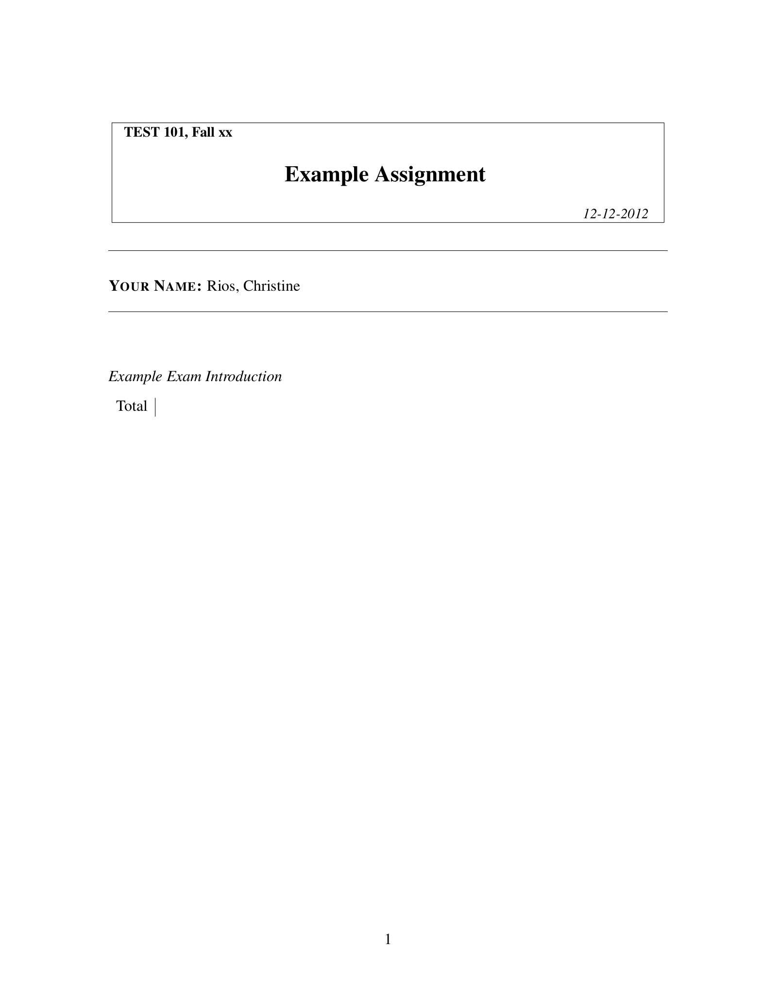

## Adding a Classroom and Roster to the Project

Classrooms are how we manage groups of students who take an instance of the
exams.
The core of each classroom is a roster of students that our library can parse.

  1. Create new `class-1.csv` in the project directory with the following
    content:

    ```csv linenums=1
    Name,Student ID,Email Address
    "Wilkins, Willa",49234720,awilkins@berkeley.edu
    "Smith, Abby",49232758,ysmith@berkeley.edu
    "Calderon, Reema",49233588,acalderon@berkeley.edu
    "Meza, Neave",49234574,emeza@berkeley.edu
    "Rios, Christine",49232540,erios@berkeley.edu
    "House, Sharon",49232926,nhouse@berkeley.edu
    "Ahmad, Ezmae",49234288,eahmad@berkeley.edu
    "Phelps, Mehdi",49233409,iphelps@berkeley.edu
    "Mcfarlane, Tracey",49232948,ymcfarlane@berkeley.edu
    "Decker, Adem",49234533,mdecker@berkeley.edu
    ```

    This is a roster of fake students in a version of the BCourses format that
    we'll be using for the tutorial.

  1. In `exam.py` change line 7 to the following:

    ```python linenums="7"
        classes = {
            'fake-class': Classroom
        }
    ```

    This tells our system that there's a `Classroom` called `fake-class` that
    we'll be building assignments for.
    However left as it this would throw an error as each `Classroom` needs
    a roster of students.

  1. To fix this we'll specify a roster based on `class-1.csv`.
    There are multiple ways to parse a roster so we'll be specifying the
    parser we'll use as well by changing line 8 to:

    ```python linenums="8"
            'fake-class': Classroom.with_options(
                roster=BCoursesCSVRoster.with_options(
                    file_name="class-1.csv"
                )
            ),
    ```

    Note how our roster is `BCoursesCSVRoster` rather than some more generic
    class. This subclass specifically describes how to parse rosters from
    BCourses, other formats would require other parsers. The dev guide will
    cover this in more detail.

    ??? quote "Complete Current `exam.py`"
        ```python linenums="1"
        #!/usr/bin/env -S pipenv run python3

        from exam_gen import *

        class NewExam(LatexDoc, Exam):

            classes = {
                'fake-class': Classroom.with_options(
                    roster=BCoursesCSVRoster.with_options(
                        file_name="class-1.csv"
                    )
                ),
            }

            questions = {}

            intro.text = r'''
            \emph{Example Exam Introduction}
            '''

            def user_setup(self, **kwargs):
                pass

        if __name__ == "__main__": run_cli(globals())
        ```

## Testing our Minimal Assignment

We can run through some basic commands to test our setup.

  1. To see what new commands we have available:

    ```console
    $ ./exam.py list
    ```

    ??? example "Result of `./exam.py list`"
        ``` linenums="1" hl_lines="2 4"
        build-exam               Build all the exams for each student.
        build-exam:class-1       Build the exams for class 'class-1'.
        build-solution           Build all the answer keys for each student.
        build-solution:class-1   Build the answer keys for class 'class-1'.
        cleanup                  Clean all generated files. (e.g. 'rm -rf ~*')
        parse-roster             parse the class rosters (incl. answer and score data if available)
        ```

  1. We now have build actions that cover an entire class's students.
    We can break this down further with:

    ```console
    $ ./exam.py list --all
    ```

    ??? example "Result of `./exam.py list --all`"
        ``` linenums="1" hl_lines="2-12 15-24"
        build-exam                          Build all the exams for each student.
        build-exam:class-1                  Build the exams for class 'class-1'.
        build-exam:class-1:acalderon
        build-exam:class-1:awilkins
        build-exam:class-1:eahmad
        build-exam:class-1:emeza
        build-exam:class-1:erios
        build-exam:class-1:iphelps
        build-exam:class-1:mdecker
        build-exam:class-1:nhouse
        build-exam:class-1:ymcfarlane
        build-exam:class-1:ysmith
        build-solution                      Build all the answer keys for each student.
        build-solution:class-1              Build the answer keys for class 'class-1'.
        build-solution:class-1:acalderon
        build-solution:class-1:awilkins
        build-solution:class-1:eahmad
        build-solution:class-1:emeza
        build-solution:class-1:erios
        build-solution:class-1:iphelps
        build-solution:class-1:mdecker
        build-solution:class-1:nhouse
        build-solution:class-1:ymcfarlane
        build-solution:class-1:ysmith
        cleanup                             Clean all generated files. (e.g. 'rm -rf ~*')
        parse-roster                        parse the class rosters (incl. answer and score data if available)
        parse-roster:class-1
        ```

    We even have actions to build an exam or solution key for each individual
    student.

  1. To test roster parsing we can run:

    ```console
    $ ./exam.py parse-roster
    ```

    You should see `.  parse-roster:fake-class` on the terminal, but more
    importantly, a `~data/` directory should have been created with a number of
    subdirectories and files.

    ??? example "Result of `tree ~data`"
        ```
        ~data/
        └── class-fake-class
            ├── roster.yaml
            ├── student-acalderon
            │   └── data.yaml
            ├── student-awilkins
            │   └── data.yaml
            ├── student-eahmad
            │   └── data.yaml
            ├── student-emeza
            │   └── data.yaml
            ├── student-erios
            │   └── data.yaml
            ├── student-iphelps
            │   └── data.yaml
            ├── student-mdecker
            │   └── data.yaml
            ├── student-nhouse
            │   └── data.yaml
            ├── student-ymcfarlane
            │   └── data.yaml
            └── student-ysmith
                └── data.yaml
        ```

    Looking at `~data/class-fake-class/roster.yaml` and the various `data.yaml`
    files will show a somewhat pretty printed representation of the class and
    student information. This will be useful for debugging later on.


  1. We can clean up out previous work and build a single exam with:

    ```console
    $ ./exam.py cleanup
    $ ./exam.py build-exam:fake-class:erios
    ```

    This will produce a number of files in `~data`, `~build`, and `~out`.

    ??? example "Result of `tree ~*`"
        ```
        ~build
        └── class-fake-class
            └── student-erios
                └── exam-exam
                    ├── output.aux
                    ├── output-intro.tex
                    ├── output.log
                    ├── output.out
                    ├── output.pdf
                    └── output.tex
        ~data
        └── class-fake-class
            ├── roster.yaml
            ├── student-acalderon
            │   └── data.yaml
            ├── student-awilkins
            │   └── data.yaml
            ├── student-eahmad
            │   └── data.yaml
            ├── student-emeza
            │   └── data.yaml
            ├── student-erios
            │   ├── data.yaml
            │   └── exam-exam
            │       ├── final-context-output-intro.yaml
            │       ├── final-context-output.yaml
            │       ├── finalize-log.yaml
            │       ├── initial-context-output-intro.yaml
            │       ├── initial-context-output.yaml
            │       ├── output-log.yaml
            │       ├── post-finalize-doc.yaml
            │       ├── post-init-doc.yaml
            │       ├── post-setup-doc.yaml
            │       ├── post-template-doc.yaml
            │       ├── pre-finalize-doc.yaml
            │       ├── pre-init-doc.yaml
            │       ├── pre-setup-doc.yaml
            │       ├── pre-template-doc.yaml
            │       ├── result-output-intro.tex
            │       ├── result-output.tex
            │       ├── setup-log.yaml
            │       ├── template-output-intro.jn2.tex
            │       ├── template-output.jn2.tex
            │       ├── template-result.yaml
            │       └── template-spec.yaml
            ├── student-iphelps
            │   └── data.yaml
            ├── student-mdecker
            │   └── data.yaml
            ├── student-nhouse
            │   └── data.yaml
            ├── student-ymcfarlane
            │   └── data.yaml
            └── student-ysmith
                └── data.yaml
        ~out
        └── exam-exam
            └── class-fake-class
                └── erios.pdf
        ```

  1. Finally we can look at the final output in
    `~out/exam-exam/class-fake-class/erios.pdf`
    there's an exam with only the title page and our introduction text.

    ??? example "Contents of `erios.pdf`"
        <center>
        { width=85% }
        </center>

    The logging and debug data in `~data/class-fake-class/student-erios/exam-exam/`
    captures a lot of the intermediate state involved in building the exam, the
    user guide will provide a deeper overview of this and how it can be used.

    There is also a build directory in
    `~build/class-fake-class/student-erios/exam-exam/` which is where we try to
    provide an isolated environment for `pdflatex` or other external build tool.
    This is also the working directory when user-provided code to generate files
    is run.
