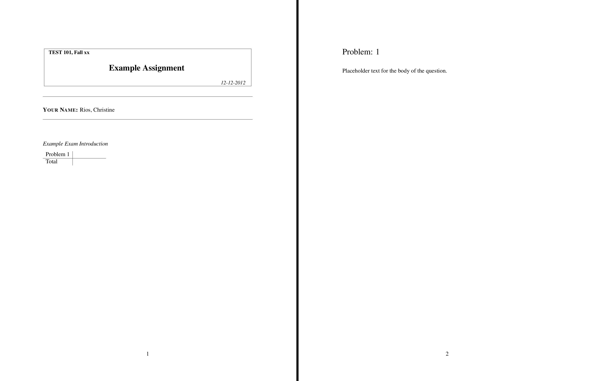

# Writing Questions

Any actual assignment requires at least one question for students to answer,
so let's add one.

  1. First we create the file:

    ```console
    $ touch addition_question.py
    ```

  1. Then in a text editor we add the following content to `addition_question.py`:

    ```python linenums="1"
    from exam_gen import *

    class SumQuestion(LatexDoc, Question):
        metadata.name = "Basic Addition Question"

        body.text = "Placeholder text for the body of the question."

        solution.text = "Placeholder text for the solution of the question."
    ```

    We then need to make sure that `exam.py` knows to include this question.

  1. First part of that is adding the appropriate import statement to `exam.py`
    on line 4:

    ```python linenums="4"
    from addition_question import *
    ```

    Note that `addition_question` here is taken from the `addition_question.py`
    filename. This is a standard python import statement.

  1. Next we need to register the question with `NewExam` by editing the
    `questions` variable to read:

    ```python linenums="16"
    questions = {
        'addition-question': SumQuestion
    }
    ```

    Note that `SumQuestion` here is the new question's class.

    ??? quote "Complete Current `exam.py`"
        ```python linenums="1"
        #!/usr/bin/env -S pipenv run python3

        from exam_gen import *
        from addition_question import *

        class NewExam(LatexDoc, Exam):

            classes = {
                'fake-class': Classroom.with_options(
                    roster=BCoursesCSVRoster.with_options(
                        file_name="class-1.csv"
                    )
                ),
            }

            questions = {
                'addition-question': SumQuestion
            }

            intro.text = r'''
            \emph{Example Exam Introduction}
            '''

            def user_setup(self, **kwargs):
                pass

        if __name__ == "__main__": run_cli(globals())
        ```

  1. We can now generate a test exam with this question:

    ```console
    $ ./exam.py cleanup
    $ ./exam.py build-exam:fake-class:erios
    ```

    The output in `~/out/exam-exam/class-fake-class/erios.pdf` should look as
    follows:

    ??? example "Contents of `erios.pdf`"
        <center>
        { width=85% }
        </center>

In the next section of the tutorial we'll flesh out the question and add some
student specific customization.
